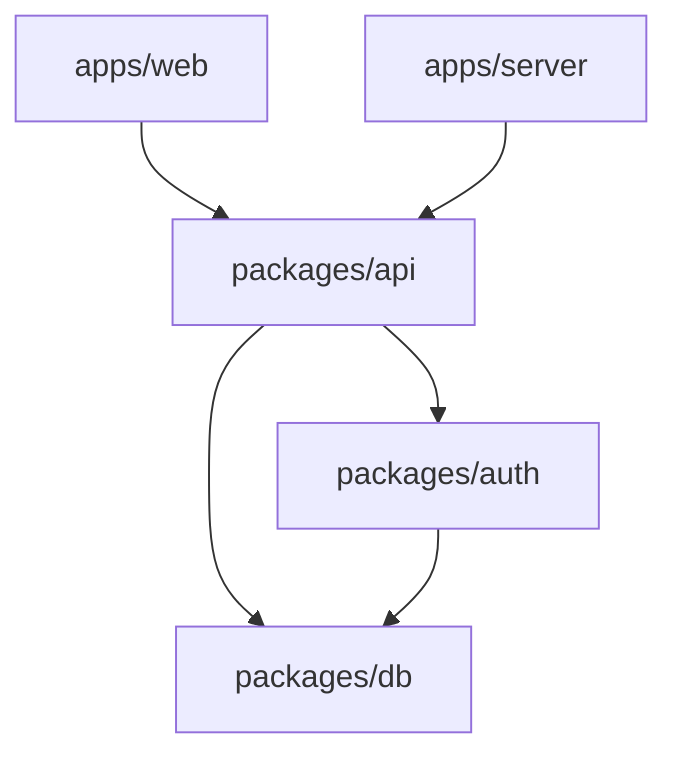
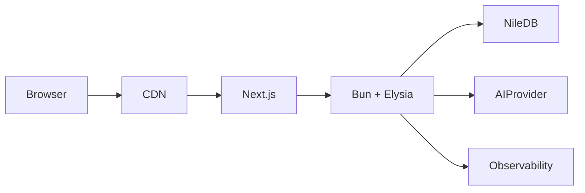

# Architecture Document

## 1. Introduction

* **Project Name:** CustomerDeskAI – White-Label Multi-Tenant Customer Support Platform
* **Document Version:** 1.2
* **Date:** 2025-12-14
* **Author(s):** David Santiago Urbano

### Purpose

This document defines the **target technical architecture** for CustomerDeskAI.
Its purpose is to provide **unambiguous technical guidance** that enables the engineering team to:

* Build a **correct-by-construction multi-tenant system**
* Preserve **strict tenant isolation** at every layer
* Maintain **end-to-end type safety** from UI to database
* Scale without introducing architectural debt
* Make future changes without violating core invariants

This document is normative: **if code contradicts this document, the code is wrong**.


## 2. Goals

### Architectural Goals

1. **Tenant Isolation as an Invariant**

   * No request, query, or side-effect may execute without an explicit tenant context.
   * Cross-tenant access must be impossible by construction.

2. **Contract-First, Type-Safe APIs**

   * A single API contract defines server, client, validation, and documentation.
   * Runtime behavior must align with compile-time guarantees.

3. **Explicit Context Propagation**

   * Authentication, authorization, tenant identity, and database access must be derived once and passed explicitly.
   * No hidden globals, no implicit state.

4. **Minimal, Enforced Abstractions**

   * Each layer has a single responsibility.
   * Abstractions exist to prevent classes of bugs, not to hide complexity.

5. **Operational Clarity**

   * Request flow, failure modes, and scaling behavior must be observable and predictable.


### Business Goals

* Support **any number of tenants** with complete brand invisibility
* Allow organizations to onboard quickly without compromising safety
* Enable AI-assisted workflows without introducing data leakage risks
* Reduce operational cost per ticket as volume grows


## 3. System Overview

### 3.1 System Context Diagram

```mermaid
flowchart LR
  User[Customer / Agent / Admin]
  User -->|HTTPS| Web[Next.js Web App]

  Web -->|oRPC| Server[Bun + Elysia API Server]

  Server -->|Auth| Auth[Better-Auth]
  Server -->|SQL via Drizzle| DB[NileDB (Postgres)]
  Server -->|Streaming| AI[AI SDK Provider]

  Server --> Obs[Logging / Metrics / Tracing]
```


### 3.2 Component Diagram




### 3.3 Deployment Diagram




## 4. Components


### 4.1 `apps/web` – Web Application

**Description**
Customer-facing and internal UI built with Next.js. Entirely stateless with respect to business logic.

**Responsibilities**

* Render tenant-branded UI
* Manage client-side routing and session state
* Invoke backend procedures through typed oRPC clients
* Never access the database directly

**Interfaces**

* oRPC client (generated from `@CustomerDeskAI/api`)
* Auth endpoints (`/api/auth/*`)

**Dependencies**

* Next.js 16, React 19
* `@orpc/client`, `@orpc/tanstack-query`
* `@CustomerDeskAI/api`, `@CustomerDeskAI/auth`

**Implementation Details**

* UI must always operate in an **active tenant context**
* Tenant identity is resolved before rendering any tenant-scoped view


### 4.2 `apps/server` – API Host

**Description**
Single HTTP entry point hosting RPC, OpenAPI, authentication, and AI streaming.

**Responsibilities**

* Route requests
* Construct execution context
* Enforce auth and tenant invariants
* Delegate business logic to API layer

**Interfaces**

* `/rpc/*` → oRPC RPC handler
* `/api-reference/*` → OpenAPI handler
* `/api/auth/*` → Better-Auth
* `/ai` → AI streaming endpoint

**Dependencies**

* Bun runtime
* Elysia framework
* oRPC (RPC + OpenAPI)
* Better-Auth
* AI SDK

**Implementation Details**

* Context is created **once per request**
* No route handler may bypass context creation
* Errors are typed and propagated consistently


### 4.3 `packages/api` – API Contract & Routers

**Description**
The **single source of truth** for all API contracts.

**Responsibilities**

* Define routers, procedures, inputs, outputs
* Validate all inputs using Zod
* Define error semantics
* Enforce authorization at procedure boundaries

**Interfaces**

* `appRouter`
* Typed procedures for client and server

**Dependencies**

* oRPC (server, client, OpenAPI, Zod)
* Zod
* Drizzle types (read-only)

**Implementation Details**

* Procedures **never** access raw DB connections
* All DB access happens through repositories provided by context


### 4.4 `packages/auth` – Authentication & Authorization

**Description**
Auth boundary integrating Better-Auth with Nile tenant semantics.

**Responsibilities**

* Session management
* Tenant membership resolution
* Role enforcement utilities

**Interfaces**

* `auth.handler(request)`
* Membership lookup helpers

**Dependencies**

* Better-Auth
* Nile tenant tables (`tenants`, `tenant_users`)

**Implementation Details**

* Organization == Tenant
* Roles are stored as arrays
* Membership verification is mandatory for all tenant-scoped actions


### 4.5 `packages/db` – Data Access Layer (Drizzle)

**Description**
Strongly-typed, tenant-scoped data access layer.

**Responsibilities**

* Define schema
* Manage migrations
* Expose tenant-scoped repositories

**Interfaces**

* `getTenantDb(context)`
* Repository factories

**Dependencies**

* Drizzle ORM
* `pg`
* NileDB

**Implementation Details**

* **No global DB instance**
* Every repository requires a tenant context
* Migrations use `drizzle-kit migrate` in production


## 5. Data Architecture

### Data Model

**Shared / Integrated**

* `tenants`
* `tenant_users`
* (optional) `users`

**Tenant-Scoped**

* `tickets`
* `ticket_messages`
* `knowledge_base_articles`
* `audit_logs`
* `branding_settings`

Every tenant-scoped table **must include `tenant_id`**.


### Data Storage

* NileDB (Postgres)
* Drizzle ORM for schema and queries
* Schema defined in code, migrations generated


### Data Flow (Canonical)

1. Client calls `/rpc/*`
2. Server creates context:

   * session
   * userId
   * tenantId
   * membership
   * tenant-scoped DB
3. Procedure validates input
4. Authorization enforced
5. Repository executes tenant-scoped query
6. Typed response returned


## 6. Security

### Security Requirements

* Strict tenant isolation
* Role-based access control
* Auditability
* AI prompt safety

### Security Measures

* Mandatory tenant context
* Explicit membership checks
* Typed authorization helpers
* Append-only audit logs
* AI inputs restricted to tenant-scoped data only


## 7. Scalability

### Scalability Requirements

* Independent tenant scaling
* No noisy-neighbor effects
* Horizontal API scaling

### Scalability Strategy

* Stateless API servers
* Nile tenant virtualization
* Indexed tenant-scoped queries
* Event-style ticket histories


## 8. Performance

### Performance Requirements

* P95 < 500ms for core RPCs
* Streaming AI responses
* Bounded query sizes

### Performance Optimization

* Pagination everywhere
* Proper DB indexing
* Caching for read-heavy KB content


## 9. Technology Stack

* **Frontend:** Next.js, React, TanStack Query
* **Backend:** Bun, Elysia
* **API:** oRPC, Zod, OpenAPI
* **Auth:** Better-Auth
* **DB:** NileDB, Drizzle ORM, pg
* **AI:** AI SDK
* **Tooling:** TypeScript, Turbo, pnpm


## 10. Deployment

* Separate deployables for web and server
* Environment-based configuration
* Migration pipeline via `drizzle-kit migrate`
* Zero-downtime rollout strategy


## 11. Monitoring

* Request latency (P50/P95/P99)
* Error rates by procedure
* Auth failures
* Tenant-level throughput
* DB query latency
* AI usage metrics


## 12. Open Issues

1. Tenant resolution strategy (domain vs header)
2. Multi-tenant user identity rules
3. Knowledge base visibility rules
4. AI cost controls per tenant


## 13. Future Considerations

* Omnichannel ingestion
* Workflow automation
* Advanced analytics
* Policy-based authorization engine


## 14. Glossary

* **Tenant:** Organizational boundary for isolation
* **Context:** Per-request execution state
* **oRPC:** Typed RPC framework
* **Drizzle:** Type-safe ORM
* **NileDB:** Multi-tenant Postgres platform